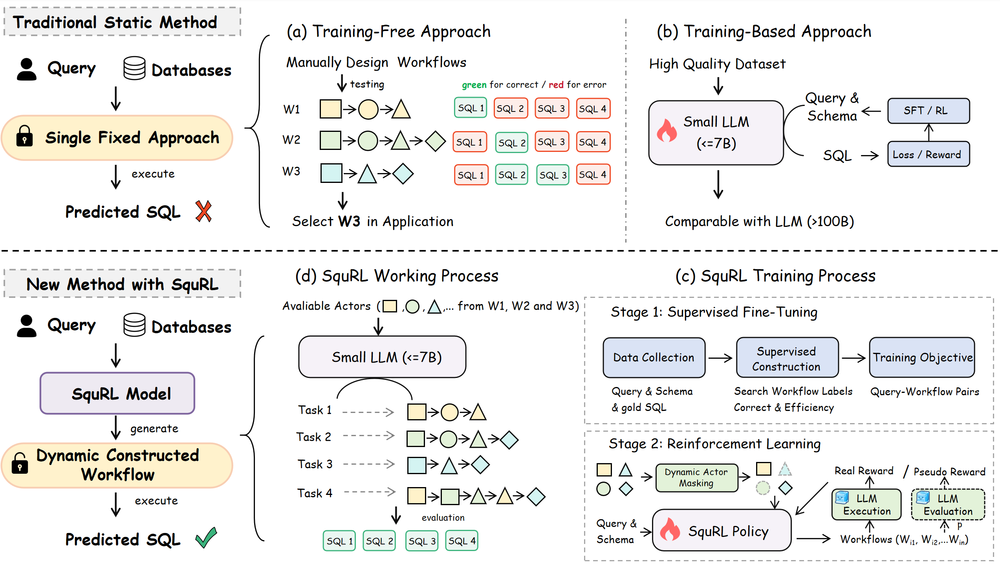

# SquRL

<div align="center">

**SquRL** - *A Scalable RL Framework for Training LLMs on Dynamic Text-to-SQL Workflow Construction.*

[](LICENSE)
[](https://www.python.org/downloads/)

</div>

---

## 📖 Overview

**SquRL** (SQL Query Reinforcement Learning) is a reinforcement learning framework that enables LLMs to adaptively construct Text-to-SQL workflows at inference time. While Text-to-SQL has achieved impressive progress, real-world applicability remains limited by reliance on single static pipelines that struggle with out-of-distribution and long-tail scenarios. SquRL learns dynamic policies that consistently outperform the best static workflow—with gains driven by heterogeneity across candidate workflows. The framework employs a rule-based reward function and two training mechanisms: *dynamic actor masking* for broader exploration, and *pseudo rewards* for improved training efficiency. Experiments on widely-used benchmarks demonstrate that SquRL outperforms state-of-the-art static methods, with especially pronounced gains on complex and out-of-distribution queries.



## 🤖 Checkpoint

| Model                    | Huggingface | ModelScope |
|---------------------------|-------------|------------|
| SquRL-1.5B (only SFT)     |      -       | [SquRL-1.5B-SFT](https://www.modelscope.cn/models/Satissss/SquRL-1.5B-SFT)     |
| SquRL-1.5B                |      -       | [SquRL-1.5B](https://www.modelscope.cn/models/Satissss/SquRL-1.5B)      |
| SquRL-7B (only SFT)       |      -       | [SquRL-7B-SFT](https://www.modelscope.cn/models/Satissss/SquRL-7B-SFT)     |
| SquRL-7B                  |      -       |    -      |


## 🚀 Quick Start

### Prerequisites

- Python 3.11 or higher
- CUDA 11.8+ (for GPU training)
- Multiple GPUs recommended for distributed training
- Sufficient disk space for model checkpoints and datasets

---

### Setup

1. **Clone the repository:**

   ```bash
   git clone https://github.com/Satissss/SquRL.git
   cd SquRL
   ```

2. **Install dependencies:**

   ```bash
   pip install -r requirements.txt
   ```

   > **Note**: Make sure you have the correct CUDA version installed that matches your PyTorch installation.

3. **Setup Squrve Backend:**

   SquRL requires the Squrve backend for reward computation and evaluation.

   a. **Clone Squrve repository:**
   
   ```bash
   git clone https://github.com/Satissss/Squrve.git
   ```

   b. **Download the benchmark dataset:**
   
   Download from Hugging Face: [`satissss/Squrve-Benchmarks`](https://huggingface.co/datasets/satissss/Squrve-Benchmarks/tree/main)

   c. **Organize directory structure:**
   
   Place the `SquRL` directory under Squrve's `benchmarks/` folder:
   
   ```text
   Squrve/
   └── benchmarks/
       └── SquRL/
           ├── database/
           ├── rl/
           └── ...
   ```

   d. **Configure API keys:**
   
   ```bash
   cd Squrve/app
   vim app_config.json
   # Add your API KEY in the configuration file
   ```

---


### Training

SquRL follows a two-stage training pipeline: **SFT** (Supervised Fine-Tuning) first, then **RL** (Reinforcement Learning) with PPO.


#### Step 1: Supervised Fine-Tuning (SFT)

Train a base model using supervised fine-tuning with LoRA (Low-Rank Adaptation):

```bash
bash scripts/sft_peft_sp.sh
```


#### Step 2: Reinforcement Learning (RL)

After SFT completes, continue with PPO-based reinforcement learning. **Prerequisite:** The Squrve backend must be running to compute rewards.

**a. Start the Squrve backend server** (in a separate terminal):

```bash
cd Squrve/app
python run.py
```

This starts the reward computation service for evaluating SQL query quality.

**b. Launch RL training:**

```bash
cd SquRL
bash scripts/rl_train_fsdp.sh
```

## 🔧 Utilization

Use SquRL for inference within [Squrve](https://github.com/Satissss/Squrve) to evaluate Text-to-SQL performance. SquRL employs the **ForkGatherAgent** for dynamic workflow construction at inference time.

### Prerequisites

- Squrve backend set up (see [Setup](#setup) section)
- SquRL model deployed as an LLM API service (e.g., via [vLLM](https://github.com/vllm-project/vllm) or [SGLang](https://github.com/sgl-project/sglang))

### Configuration

1. **Edit the startup config:**

   ```bash
   cd Squrve
   vim startup/startup_config.json
   ```

2. **Add a ForkGatherAgent task** to the `task_meta` list with the following configuration:

   ```json
   {
     "task_id": "agent",
     "task_type": "AgentTask",
     "data_source": "<path to your NL question data>",
     "schema_source": "<path to database schemas>",
     "dataset_save_path": "<path to save evaluation results>",
     "is_save_dataset": true,
     "eval_type": ["execute_accuracy"],
     "meta": {
       "task": {
         "agent_type": "ForkGatherAgent"
       },
       "actor": {
         "max_n": 5,
         "select_type": "FastExecSelector",
         "rollout_llm_args": {
           "api_key": "<API key for your LLM service>",
           "base_url": "<URL of your deployed SquRL model>",
           "temperature": 1.0
         }
       }
     },
     "open_parallel": true,
     "max_workers": 5
   }
   ```

3. **Key parameters:**

   | Parameter | Description |
   |-----------|-------------|
   | `data_source` | Path to natural language question dataset |
   | `schema_source` | Path to database schema definitions |
   | `dataset_save_path` | Directory to save evaluation outputs |
   | `max_n` | Number of candidate workflows to explore per query |
   | `select_type` | Selector for choosing final SQL (e.g., `FastExecSelector`) |
   | `rollout_llm_args.base_url` | API endpoint of your deployed SquRL model |
   | `rollout_llm_args.api_key` | API key for the LLM service |


## 🤝 Contributing

Contributions are welcome! Please feel free to:

- Report bugs and issues
- Suggest new features or improvements
- Submit pull requests

Please ensure your code follows the existing style and includes appropriate tests.


## 🙏 Acknowledgments

- Built on top of the [SQL-R1](https://github.com/DataArcTech/SQL-R1) framework
- Uses [Squrve](https://github.com/Satissss/Squrve) for Text-to-SQL evaluation


## 📄 Reference

If you use SquRL in your research, please cite our paper:

> **Beyond Static Pipelines: Learning Dynamic Workflows for Text-to-SQL**  
> Yihan Wang, Peiyu Liu, Runyu Chen, Wei Xu  
> *arXiv preprint arXiv:2602.15564*, 2026  
> [📄 Paper](https://arxiv.org/abs/2602.15564) | [DOI](https://doi.org/10.48550/arXiv.2602.15564)

**BibTeX:**

```bibtex
@article{wang2026beyond,
  title   = {Beyond Static Pipelines: Learning Dynamic Workflows for Text-to-SQL},
  author  = {Wang, Yihan and Liu, Peiyu and Chen, Runyu and Xu, Wei},
  journal = {arXiv preprint arXiv:2602.15564},
  year    = {2026},
  doi     = {10.48550/arXiv.2602.15564},
  url     = {https://arxiv.org/abs/2602.15564}
}
```

---

<div align="center">

**Star ⭐ this repository if you find it helpful!**

</div>
